<a href="https://mostlygino.com">
  <picture>
    <source media="(prefers-color-scheme: dark)" srcset="assets/banner-dark.svg">
    
  </picture>
</a>

<p align="center">
  <a href="#showreel"><picture><source media="(prefers-color-scheme: dark)" srcset="assets/cards/nav-showreel-dark.svg"></picture></a>
  <a href="#more"><picture><source media="(prefers-color-scheme: dark)" srcset="assets/cards/nav-more-dark.svg"></picture></a>
  <a href="#contact"><picture><source media="(prefers-color-scheme: dark)" srcset="assets/cards/nav-contact-dark.svg"></picture></a>
  <a href="https://mostlygino.com"><picture><source media="(prefers-color-scheme: dark)" srcset="assets/cards/nav-site-dark.svg">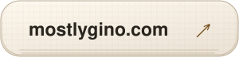</picture></a>
</p>

<p align="center">
  <a href="https://mostlygino.com"><picture><source media="(prefers-color-scheme: dark)" srcset="assets/cards/intro-dark.svg">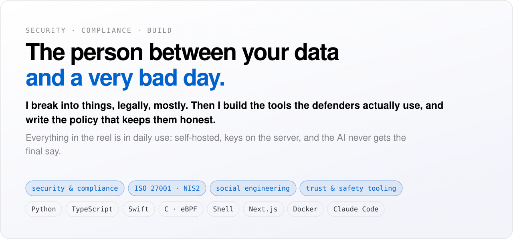</picture></a>
</p>

<p align="center">
  <a href="#showreel"><picture><source media="(prefers-color-scheme: dark)" srcset="assets/cards/stats-dark.svg">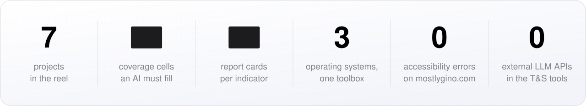</picture></a>
</p>

<br>

## Showreel

<p align="center">
  <a href="#showreel"></a>
  <a href="#showreel">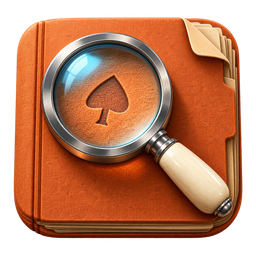</a>
  <a href="#showreel"></a>
  <a href="#showreel"></a>
  <a href="#showreel">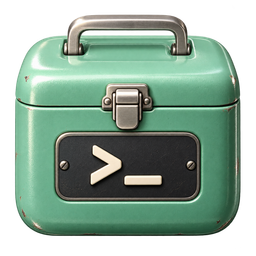</a>
  <a href="#showreel">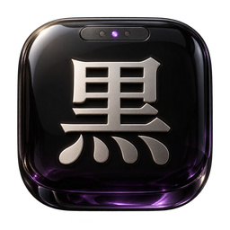</a>
</p>

<p align="center">
  
</p>

<p align="center">
  <a href="https://mostlygino.com"><picture><source media="(prefers-color-scheme: dark)" srcset="assets/cards/project-zeron-dark.svg">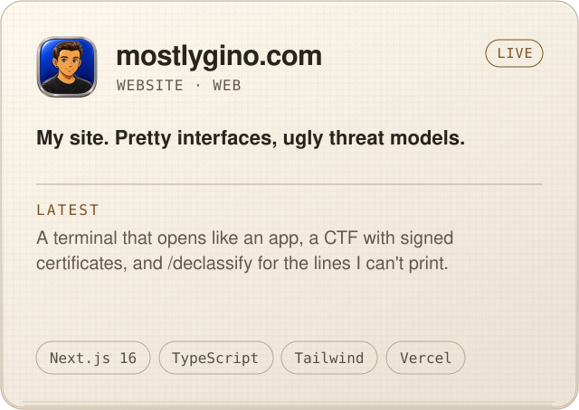</picture></a>
  <a href="#contact"><picture><source media="(prefers-color-scheme: dark)" srcset="assets/cards/project-enma-dark.svg">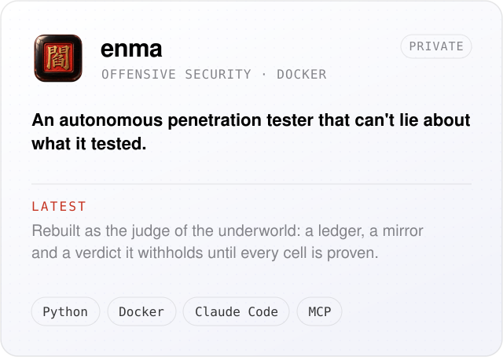</picture></a>
</p>
<p align="center">
  <a href="#contact"><picture><source media="(prefers-color-scheme: dark)" srcset="assets/cards/project-gravedigger-dark.svg">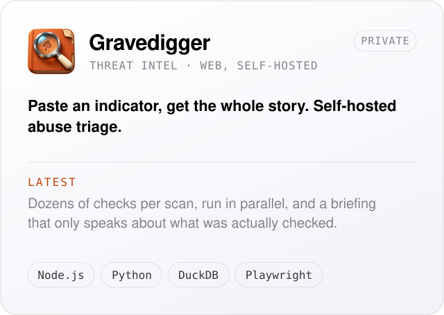</picture></a>
  <a href="#contact"><picture><source media="(prefers-color-scheme: dark)" srcset="assets/cards/project-hettie-dark.svg">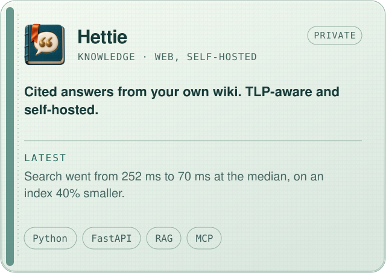</picture></a>
</p>
<p align="center">
  <a href="#contact"><picture><source media="(prefers-color-scheme: dark)" srcset="assets/cards/project-relay-dark.svg">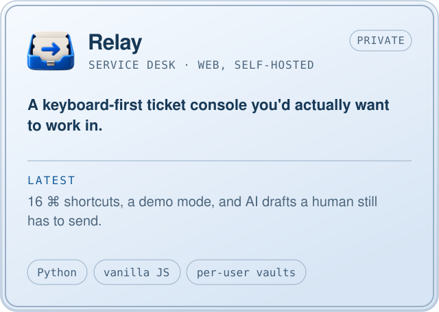</picture></a>
  <a href="#contact"><picture><source media="(prefers-color-scheme: dark)" srcset="assets/cards/project-tsukumo-dark.svg">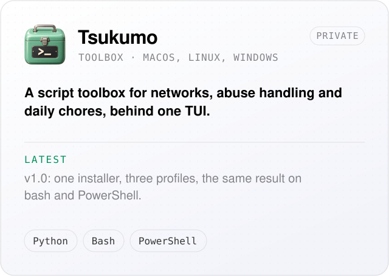</picture></a>
</p>
<p align="center">
  <a href="#contact"><picture><source media="(prefers-color-scheme: dark)" srcset="assets/cards/project-kuro-dark.svg">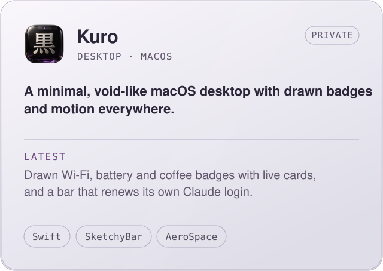</picture></a>
  <a href="#contact"><picture><source media="(prefers-color-scheme: dark)" srcset="assets/cards/project-classified-dark.svg">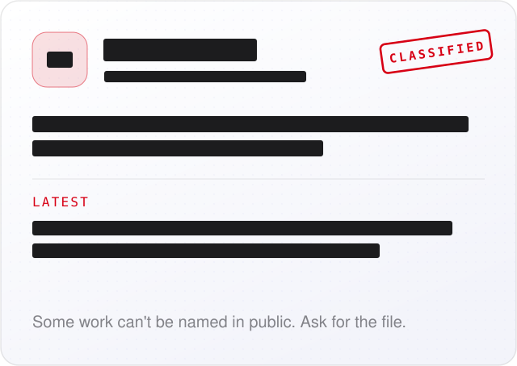</picture></a>
</p>

<p align="center">
  <a href="#contact"><picture><source media="(prefers-color-scheme: dark)" srcset="assets/cards/footnote-dark.svg">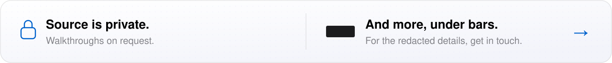</picture></a>
</p>

<p align="center">
  <a href="#contact"><picture><source media="(prefers-color-scheme: dark)" srcset="assets/cards/principles-dark.svg">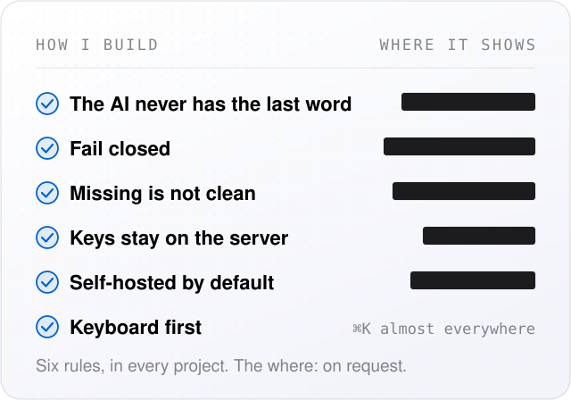</picture></a>
  <a href="#contact"><picture><source media="(prefers-color-scheme: dark)" srcset="assets/cards/stories-dark.svg">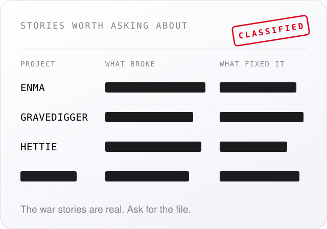</picture></a>
</p>

<br>

## More

<p align="center">
  <a href="https://mostlygino.com"><picture><source media="(prefers-color-scheme: dark)" srcset="assets/cards/site-dark.svg">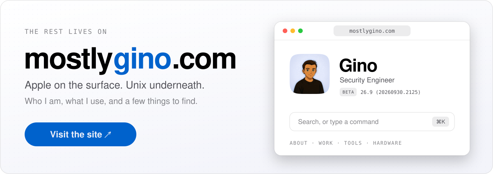</picture></a>
</p>

<br>

## Contact

<p align="center">
  <a href="mailto:hello@mostlygino.com"><picture><source media="(prefers-color-scheme: dark)" srcset="assets/cards/contact-dark.svg">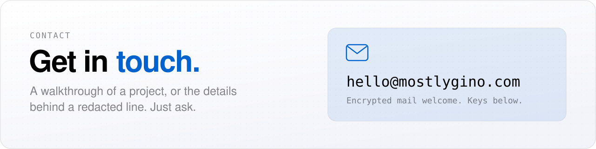</picture></a>
</p>

<p align="center">
  <a href="keys/hello.asc"><picture><source media="(prefers-color-scheme: dark)" srcset="assets/cards/key-hello-dark.svg">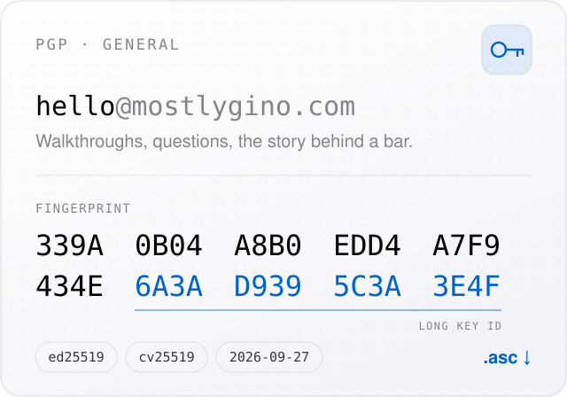</picture></a>
  <a href="keys/security.asc"><picture><source media="(prefers-color-scheme: dark)" srcset="assets/cards/key-security-dark.svg">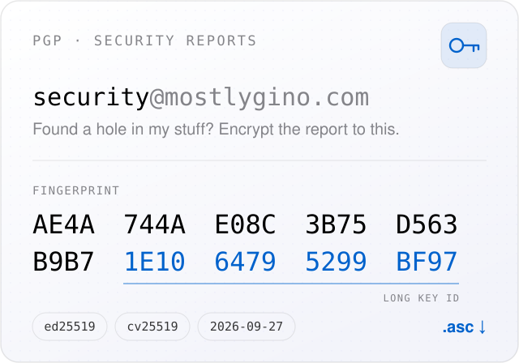</picture></a>
</p>

```sh
# both keys, straight from keys.openpgp.org
gpg --keyserver hkps://keys.openpgp.org --recv-keys \
  339A0B04A8B0EDD4A7F9434E6A3AD9395C3A3E4F \
  AE4A744AE08C3B75D563B9B71E1064795299BF97
```

<p align="center">
  <a href="mailto:hello@mostlygino.com">hello@mostlygino.com</a> ·
  <a href="mailto:security@mostlygino.com">security@mostlygino.com</a> ·
  <a href="https://mostlygino.com/.well-known/security.txt">security.txt</a>
</p>

<br>

<p align="center"><sub>here be questionable code</sub></p>
