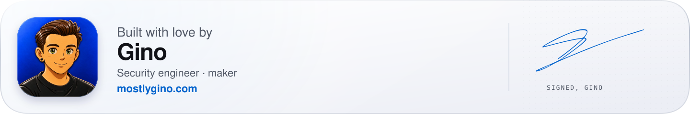

# Built with love by Gino

A reusable maker's card for the end of a README, project page or case study. Gino's cobalt portrait and real autograph sit on a glass surface, using the site's blue, type hierarchy and restrained motion.



## Add to a README

Paste this at the bottom of any README. The whole card links to mostlygino.com; light/dark and phone layouts switch automatically. The SVG embeds its portrait and signature, with no scripts, fonts or image requests to another server.

```html
<a href="https://mostlygino.com">
  <picture>
    <source media="(max-width: 600px) and (prefers-color-scheme: dark)" srcset="https://raw.githubusercontent.com/mostlygino/mostlygino/main/assets/signoff/built-with-love-dark-mobile.svg">
    <source media="(max-width: 600px)" srcset="https://raw.githubusercontent.com/mostlygino/mostlygino/main/assets/signoff/built-with-love-light-mobile.svg">
    <source media="(prefers-color-scheme: dark)" srcset="https://raw.githubusercontent.com/mostlygino/mostlygino/main/assets/signoff/built-with-love-dark.svg">
    
  </picture>
</a>
```

## Compact footer

A quieter, static alternative for shorter project READMEs.



```html
<a href="https://mostlygino.com">
  <picture>
    <source media="(max-width: 600px) and (prefers-color-scheme: dark)" srcset="https://raw.githubusercontent.com/mostlygino/mostlygino/main/assets/signoff/built-with-love-compact-dark-mobile.svg">
    <source media="(max-width: 600px)" srcset="https://raw.githubusercontent.com/mostlygino/mostlygino/main/assets/signoff/built-with-love-compact-light-mobile.svg">
    <source media="(prefers-color-scheme: dark)" srcset="https://raw.githubusercontent.com/mostlygino/mostlygino/main/assets/signoff/built-with-love-compact-dark.svg">
    
  </picture>
</a>
```

## Files and motion

| Variant | Desktop | Phone | Motion |
| --- | --- | --- | --- |
| Full | 1440 × 420 | 720 × 640 | Signature writes once; one soft light pass, then still |
| Full static | 1440 × 420 | 720 × 640 | None |
| Compact | 1440 × 240 | 720 × 300 | None |

Each is available in light and dark under [`assets/signoff`](../../assets/signoff). For the full static version, replace `.svg` with `-static.svg` in the first snippet. For example: `built-with-love-dark-mobile-static.svg`.

Reduced-motion preference displays the complete signature immediately. All wording and the portrait remain visible while it writes. Systems that strip SVG styles get a complete static card. The image has no clickable controls internally: the surrounding link supplies navigation and the alt text supplies its accessible name.

For a web page, use the same `<picture>` markup and give the image `display:block; width:100%; height:auto`. Copy the assets locally when the site's image policy requires same-origin files. A simple Markdown-only fallback is:

```md
[](https://mostlygino.com)
```

The URLs follow `main`, so future design updates carry through. Pin a commit in place of `main` for a frozen copy. GitHub may cache image updates. Sites that reject SVG can use a PNG export; PNGs are static and need separate light/dark selection.

## Sources and regeneration

Run `python3 signoff.py` from the repository root (Python 3.9+, standard library only). It deterministically writes the twelve SVG variants. The portrait and autograph sources are private and are not in this repository; the script reads them from the site repo (`ZERON` environment variable, default `../zeron`). Text uses native system fonts, so exact glyph shapes can vary by platform.

- Portrait and autograph: Gino's own artwork and handwritten signature. All rights reserved, see [LICENSE](../../LICENSE).
- Material: white/silver and graphite glass, system blue `#0062cc` / `#4da2ff`, a cobalt enamel heart, top-left light and a fine technical dot field. The portrait carries the richest material detail.
- Layout: authored desktop and phone compositions; compact versions retain the name, profession, portrait, autograph and site link.

The kit is provided separately so it can be placed per project. It is not automatically appended to existing READMEs.
